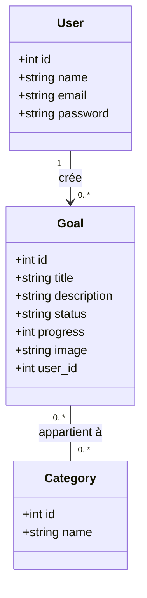

# Projet technique

## Goals Tracker Website (Suivi des Objectifs)

**Réalisé par :**
**MALLOULI Abdelhay**

**Encadré par :**
**M. ESSARRAJ Fouad**

---

# Contexte du projet

* Projet pour appliquer les connaissances acquises
* Suivi des objectifs personnels ou professionnels
* Méthodologie **2TUP** :

  * Fonctionnelle
  * Technique
  * Réalisation
* Préparation pour une **démonstration live**
---

---
# watterfall 

---

# Analyse technique

## Technologies utilisées

1. Base de données : **MySQL**
2. Architecture : **N-Tiers**
3. Framework : **Laravel 12**
4. Architecture logicielle : **MVC**
5. Moteur de vues : **Blade**
6. **AJAX**
7. Upload d’images
8. **Laravel Multilangue**
---
9. **Vite**
10. **Preline UI Library**
11. **Lucide Icons Library**

---

# Analyse Fonctionnelle

## Cas d'utilisation

---

# Conception

## Diagramme de Classes

---

# Sujet – Live Coding

* Bouton **« Ajouter »** ouvrant une **modale** pour créer un nouvel objectif
* **Barre de recherche** filtrant les objectifs par **titre**
* Mise à jour dynamique avec **AJAX**

